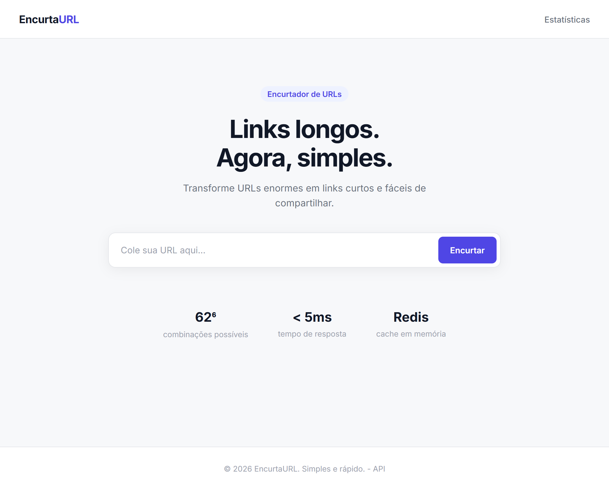
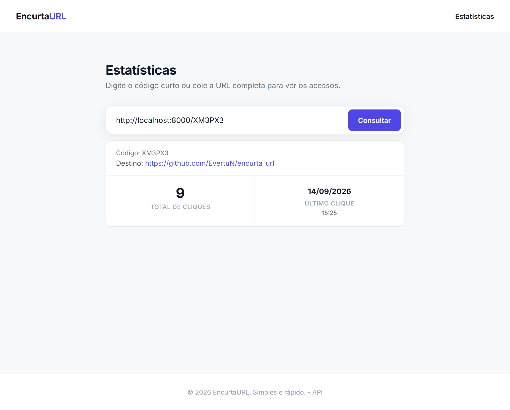

# EncurtaURL

> Um serviço moderno, performático e minimalista de **encurtamento de URLs**, com arquitetura em camadas, cache distribuído com estratégia *Cache-Aside*, coleta de métricas de acesso em segundo plano e interface web limpa.

[](https://www.python.org/)
[](https://fastapi.tiangolo.com/)
[](https://www.postgresql.org/)
[](https://redis.io/)
[](https://www.docker.com/)
[](https://astral.sh/ruff)
[](https://pytest.org/)

---

## 📑 Sumário

- [Visão Geral](#-visão-geral)
- [Funcionalidades](#-funcionalidades)
- [Arquitetura & Fluxo](#-arquitetura--fluxo)
- [Stack Tecnológica](#-stack-tecnológica)
- [Estrutura do Projeto](#-estrutura-do-projeto)
- [Como Executar com Docker](#-como-executar-com-docker)
- [Endpoints da API](#-endpoints-da-api)
- [Frontend](#-frontend)
- [Qualidade e Testes](#-qualidade-e-testes)
- [Documentação Interativa](#-documentação-interativa)

---

## 🎯 Visão Geral

O **EncurtaURL** foi projetado com foco em boas práticas de engenharia de software:
- Separação clara de responsabilidades (Routers, Services, Repositories, Models e Schemas).
- Alta concorrência e baixa latência utilizando async/await em todas as camadas de I/O.
- Cache-Aside com Redis para servir redirecionamentos instantâneos sem sobrecarregar o banco de dados.
- Processamento assíncrono de eventos de clique com `BackgroundTasks`.
- Interface web limpa, sem bibliotecas pesadas e orientada a tokens de design via variáveis CSS.

<p align="center">
  
</p>

---

## 🚀 Funcionalidades

- **Encurtamento automático**: gera códigos aleatórios seguros de 6 caracteres alfanuméricos com retry contra colisões.
- **Códigos personalizados (*custom slug*)**: permite escolher apelidos amigáveis (ex: `meu-link`).
- **Data de expiração opcional**: suporte a links temporários.
- **Redirecionamento 302 rápido**: resposta direta do Redis com fallback transparente para o PostgreSQL.
- **Coleta de métricas em background**: registro não bloqueante de IP, User-Agent, Referer e timestamp.
- **Estatísticas detalhadas**: consulta de total de cliques, último acesso e top referers.
- **Remoção com invalidação atômica**: remoção no banco com cascata de cliques e expurgo imediato do cache.

---

## 🏛 Arquitetura & Fluxo

### 1. Criação de URL (`POST /urls`)

```text
Cliente                  FastAPI                  PostgreSQL
   │                        │                         │
   │─── POST /urls ────────►│                         │
   │    {"original_url"}    │─── Verifica/Insere ────►│
   │                        │◄── URL criada ──────────│
   │◄── 201 Created ────────│
```

### 2. Redirecionamento com Cache-Aside (`GET /{short_code}`)

```text
Cliente                  FastAPI                    Redis                   PostgreSQL
   │                        │                         │                         │
   │─── GET /{short_code} ─►│                         │                         │
   │                        │─── GET url:{code} ─────►│                         │
   │                        │                         │                         │
   │                        │◄── HIT (URL original) ──│                         │
   │                        │   OU                    │                         │
   │                        │◄── MISS ────────────────│                         │
   │                        │                         │                         │
   │                        │─── (se MISS) SELECT ─────────────────────────────►│
   │                        │◄── URL original ──────────────────────────────────│
   │                        │─── SETEX cache ────────►│                         │
   │                        │                                                   │
   │◄── 302 Redirect ───────│                                                   │
   │                        │─── BackgroundTasks (record_click) ───────────────►│
```

---

## 🛠 Stack Tecnológica

### Backend
- **Python 3.12**
- **FastAPI 0.111** — framework assíncrono para a API REST
- **SQLAlchemy 2.0 (Asyncio)** — ORM assíncrono
- **asyncpg 0.29** — driver PostgreSQL assíncrono de alta performance
- **Redis 7 (redis-py async)** — camada de cache em memória
- **Alembic 1.13** — controle de versões e migrações do banco de dados
- **Pydantic v2** — validação de esquemas e serialização de dados

### Frontend
- **HTML5 & CSS3 Vanilla** — design minimalista e moderno, sem frameworks pesados
- **Variables CSS (`variables.css`)** — paleta de cores e tipografia centralizadas
- **Partials (`header.html`, `footer.html`)** — componentes reaproveitados sem duplicação

### Qualidade & Ferramentas
- **Docker & Docker Compose** — containerização de toda a stack
- **Ruff** — linter e formatador de código ultrarrápido
- **Pytest + Pytest-Asyncio + Pytest-Cov** — suíte de testes com cobertura de código

---

## 📁 Estrutura do Projeto

```text
encurtaurl/
├── backend/
│   ├── alembic/              # Scripts e configurações de migração
│   ├── app/
│   │   ├── database/         # Conexões assíncronas (PostgreSQL e Redis)
│   │   ├── models/           # Modelos SQLAlchemy (Url, ClickEvent)
│   │   ├── repositories/     # Consultas e operações de banco de dados
│   │   ├── routes/           # Endpoints HTTP da API (urls, redirect)
│   │   ├── schemas/          # Schemas Pydantic de entrada e saída
│   │   ├── services/         # Regras de negócio (shortcode, cache, métricas)
│   │   ├── config.py         # Configurações via variáveis de ambiente
│   │   └── main.py           # Ponto de entrada FastAPI e arquivos estáticos
│   ├── tests/                # Testes de integração e unitários
│   ├── Dockerfile
│   ├── pyproject.toml        # Configurações do Ruff, Pytest e Cobertura
│   └── requirements.txt
├── frontend/
│   ├── assets/               # Imagens e favicon (logo.svg)
│   ├── css/                  # Folhas de estilo (variables, layout, index, stats)
│   ├── js/                   # Scripts do cliente (common, index, stats)
│   ├── partials/             # Componentes reutilizáveis (header, footer)
│   ├── index.html            # Página inicial de encurtamento
│   └── stats.html            # Página de consulta de estatísticas
├── docker-compose.yml
├── .env.example
├── .gitignore
└── README.md
```

---

## 🐳 Como Executar com Docker

### 1. Clonar o repositório e configurar o `.env`

```bash
git clone https://github.com/EvertuN/encurta_url.git
cd encurta_url

# Copie o arquivo de variáveis de ambiente
cp .env.example .env
```

### 2. Iniciar os containers

```bash
docker compose up -d --build
```

Os seguintes serviços serão inicializados:
- **API**: `http://localhost:8000`
- **PostgreSQL**: porta `5432`
- **Redis**: porta `6379`

### 3. Executar as migrações do banco

```bash
docker compose exec api alembic upgrade head
```

Para verificar o status da aplicação:
```bash
curl http://localhost:8000/health
# {"status":"ok","env":"development"}
```

---

## 🔌 Endpoints da API

| Método | Rota | Descrição | Status Sucesso |
|---|---|---|:---:|
| `POST` | `/urls` | Cria uma nova URL encurtada | `201 Created` |
| `GET` | `/{short_code}` | Redireciona para a URL original | `302 Found` |
| `GET` | `/urls/{short_code}` | Retorna dados cadastrais da URL | `200 OK` |
| `GET` | `/urls/{short_code}/stats` | Retorna métricas e cliques da URL | `200 OK` |
| `DELETE` | `/urls/{short_code}` | Remove URL, cliques e limpa o cache | `204 No Content` |
| `GET` | `/health` | Healthcheck da API | `200 OK` |

### Exemplos de Requisição

#### Criar URL curta
```bash
curl -X POST http://localhost:8000/urls \
  -H "Content-Type: application/json" \
  -d '{"original_url": "https://google.com"}'
```

**Resposta (`201 Created`):**
```json
{
  "id": "fabc8e06-6a2e-44a2-8860-9a21f7fba456",
  "short_code": "5V3JJF",
  "original_url": "https://google.com/",
  "short_url": "http://localhost:8000/5V3JJF",
  "created_at": "2026-09-11T21:56:15.895909Z",
  "expires_at": null
}
```

#### Consultar estatísticas
```bash
curl http://localhost:8000/urls/5V3JJF/stats
```

**Resposta (`200 OK`):**
```json
{
  "short_code": "5V3JJF",
  "original_url": "https://google.com/",
  "created_at": "2026-09-11T21:56:15.895909Z",
  "total_clicks": 14,
  "last_clicked_at": "2026-09-14T11:00:00.000000Z",
  "top_referrers": [
    {"referer": "https://t.co", "clicks": 8},
    {"referer": "direct", "clicks": 6}
  ]
}
```

---

## 🎨 Frontend

O frontend é servido diretamente pela API através de rotas dedicadas e arquivos estáticos:

- **Página Inicial (`GET /`)**: Interface para encurtar links com opção de custom slug.
- **Página de Estatísticas (`GET /stats`)**: Interface para consultar métricas, total de cliques e histórico de acessos.
- **Tokens de Cores (`frontend/css/variables.css`)**: Centraliza paleta de cores (fundo, cartões, tipografia, bordas e estados de botão).
- **Partials Reutilizáveis (`frontend/partials/`)**: Header de navegação e Footer unificados carregados de forma assíncrona.

<p align="center">
  
</p>

---

## 🧪 Qualidade e Testes

Todos os comandos de validação podem ser executados dentro do container:

### Executar a suíte de testes com cobertura
```bash
docker compose exec api pytest tests/ -v --tb=short --cov=app --cov-report=term-missing
```

> **Meta atingida:** Cobertura de **85.5%** com 45 testes automatizados cobrindo rotas, modelos, serviços, repositórios e frontend.

### Verificar padronização de código com o Ruff
```bash
# Verificação de linting
docker compose exec api ruff check .

# Verificação de formatação
docker compose exec api ruff format . --check
```

---

## 📖 Documentação Interativa

Com o serviço em execução, acesse a documentação interativa nos seguintes endereços:

- **Swagger UI**: [http://localhost:8000/docs](http://localhost:8000/docs)
- **ReDoc**: [http://localhost:8000/redoc](http://localhost:8000/redoc)
